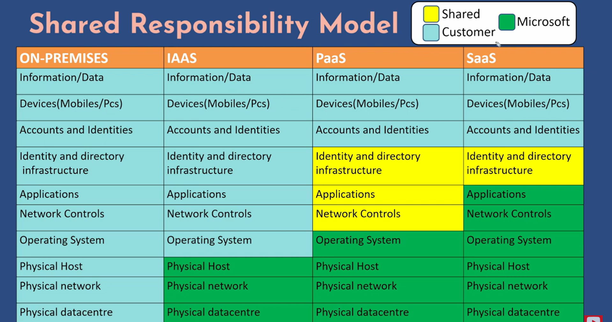
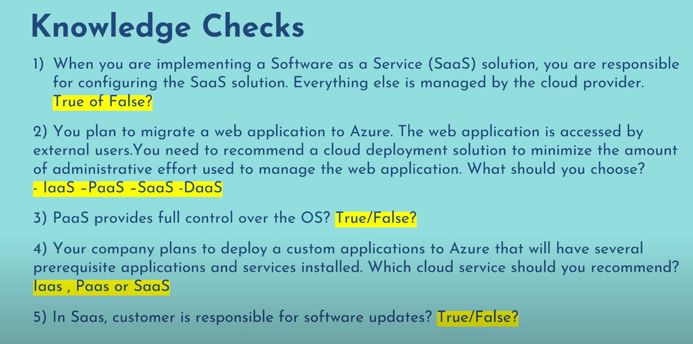
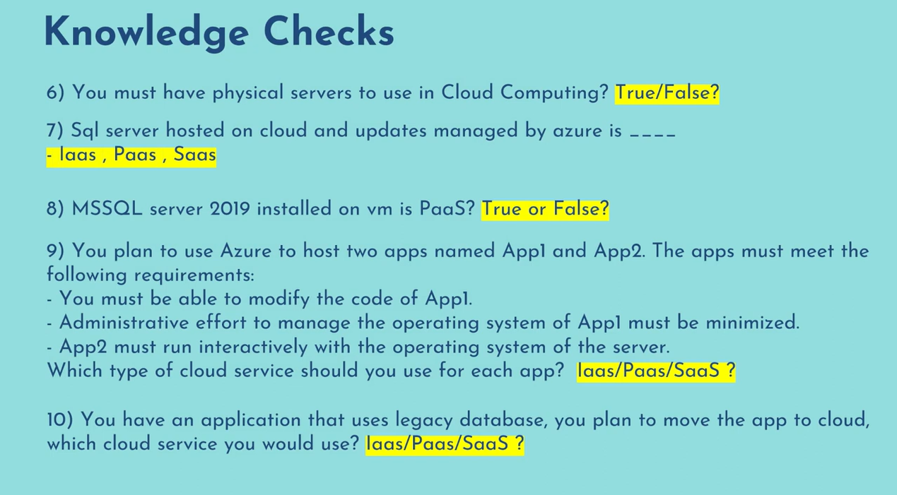

# Cloud Computing
Cloud computing is the delivery of computing services over the internet, including storage, servers, networking, databases, software, analytics, and intelligence. It allows users to rent IT services, such as computing power, storage, and databases, on an as-needed basis,instead of buying, owning, and maintaining physical data centers and servers.

This pay-as-you-go model helps users lower their operating costs, run their infrastructure more efficiently, and scale as their business needs change.

## IAAS
- Infrastructure as a service
- Give fullcontrol over infra resources such as virtual machine, storage etc, you can configure OS as per your needs.
- You must take care of all admin tasks such as patching, upgrades, backups. ( Patching means all your softwares & operating system, packages are uptodate and have all the fixes of security and vulnerability )
- Pay Per Use, EC2, VM, GCE
- Ideal choice for lift and shift migration and legacy application ( Lift and shift is nothing but when you have to move your application hosted **On Premises** to the cloud infrastructure so that you get all the benefits of cloud but you do not want any changes to your application. )

## PAAS
- Platform as a service
- Gives runtime environment / platform to deploy applications and development tools
- Azure takes care of all admin tasks including automated backups.
- Pay per service model, Azure Web App
- Ideal choice where customer doesn't want to take care of admin tasks.

## SAAS
- Software as a service
- Give application access to the end users ( Just use them as a user )
- Azure takes care of all admin tasks
- Pay per subscription models, O365, Gmail, dropbox etc.
- Ideal choice where customer can use the satandard version of a cloud application.

## Shared Responsibility Model

- **On Premise:** You have to manage everything
- **IAAS:** You don't worry about physical infrastructure.
- **PAAS:** Microsoft manages physical infra but also manages your operating system
- **SAAS:** Your application and network control will also be managed by microsoft. ( Single Sign On SSO OAUTH this all needs to be done by user here accounts and identities )

## Knowledge Checks

- 1- True
- 2- PaaS
- 3- False
- 4- IaaS
- 5- False
- 6- False
- 7- PaaS
- 8 - False
- 9 - PaaS
- 10 - IaaS