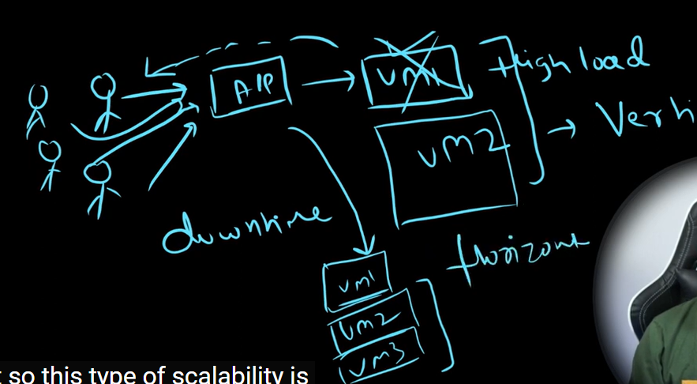
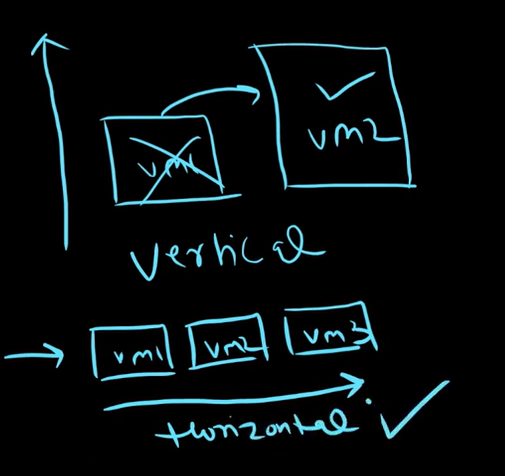
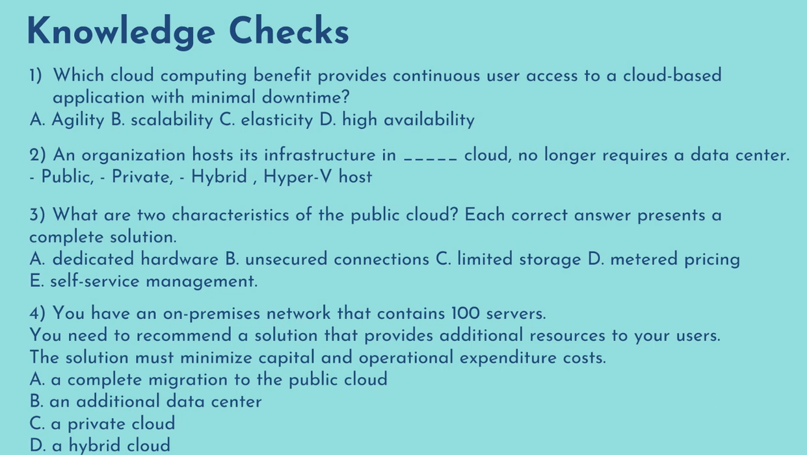
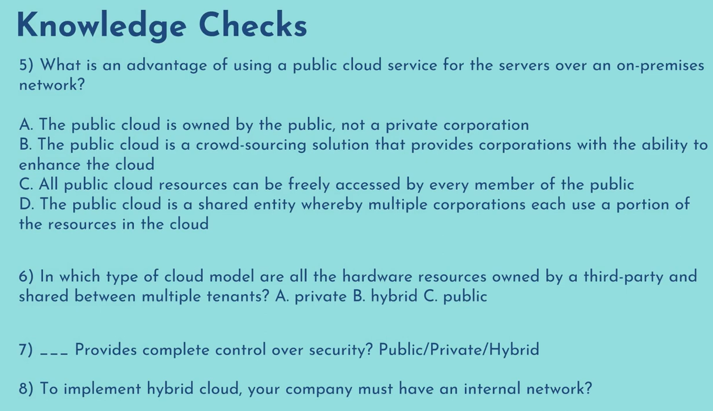

## Difference Between Public, Private & Hybrid Cloud

| Public | Private | Hybrid |
| ------ | ------- | ------ |
| In a public cloud resources are shared among multiple users, and customers only pay for the resources they use. (AWS, GCP, Azure, Oracle Cloud and many more...) | Resources are not shared with other oraganisations, providing greater control and security. (Organisations that have there own data centers and they help other customers to host there workload on there data centers) | Use both public and private cloud in an inter-connected environment. |
| Hosted and operated by a third party cloud service provider, such as AWS, Azure or GCP | Operated and maintanined by a single oraganisation. A private cloud maybe hosted on-premises or in a data center. | Provides extra layer of security as you can choose which resources to keep in private cloud and which resources in public cloud |
| Public cloud is like taking a bus where other passengers also share the ride and you dont have to worry about the physical maintenance capital expenditure and you only pay when you ride the bus | It's like driving your own car where you buy your own car which is capital expenditure and you are responsible for it's maintenance but you have more control over it like who can drive the car or you can lock it in garage providing more security | Hybrid cloud is like combination of both you drive your own car while work and use public transport when driving elsewhere this allows you to take advantage of both the features |
| Here you have genrally no or minimum capital expenditure to scale up. Resources can be provisioned or decommisioned on demand (Pay for what you use) | High CapEx. Hardware needs to be purchased first. | Resources can be added on demand by scaling up in the public cloud environment. |

## Benifits of using cloud computing

### High availabilty and false tolerance

It is designed in such a way that even if VM 1 is failed application will still respond back to customer using VM2.

Even if there is database failure your application will still able to respond to customer using the secondary databse.

VM Scaleset (VMSS) is a template so whenever ther is a failure like VM2 goes down using this template it will provision a new VM.

It will make sure we always have 2 instances listening to app front.

### Scalability
Ability of the system to adjust according to the demand

Let's say there is not much load right now when customer is accessing the application he is getting reply back from application

Let's say user count gets increased on application and all of them will be accessing the application on the same time

In regular scenario this application will get crashed and user will not able to get any results back. To avoid that there is this concept of **Scalabilty**.

### Vertical Scaling

Replace with bigger VM more power, more RAM and more resources required to manage these many users accessing the app ans so this type of scaling is known as **Vertical Scaling**.

Now it has some disadvantages
- Downtime and it is not possible to do this multiple times a day it's not a feasible solution.

### Horizontal Scaling

So what we can do we can add some additional VM's to handle load.

So what happens if let's say you have 10 users and you scale out system to 3 VM's but whenever users stops accessing application like say let's there is 1 user now than application will able to scale down back to 1 VM.

Horizontal is more preffered but also vertical is used as per usecase.

## Elasticity
It's similar to scalabilty it just happens automatically.

There should be mechanism where it does automatically as per demand.
- AWS: Autoscaling
- Azure: VMSS (VM Scaleset)
- GCP: Instance Groups

## Cost Effectiveness
### Pricing Calculator
Estimate the price of Azure services.
VM -> 12GB, 80GB HDD, US-Central .. and all other features So based on this pricing calculator will provide you an estimated cost.

### TCO (Total Cost of Ownership)
On-Premise -> Cloud

It provides an estimate on how much you are paying on-premise and compared to on cloud. So it will tell how you will able to save cost when you move to cloud some summary report generated.

## Knowledge Checks

