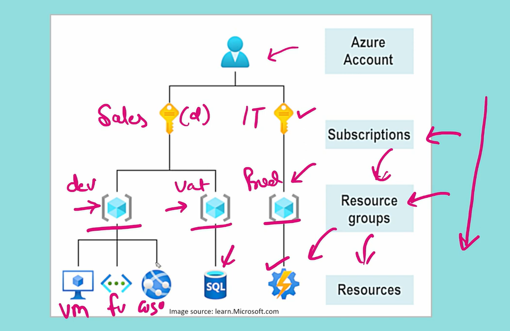
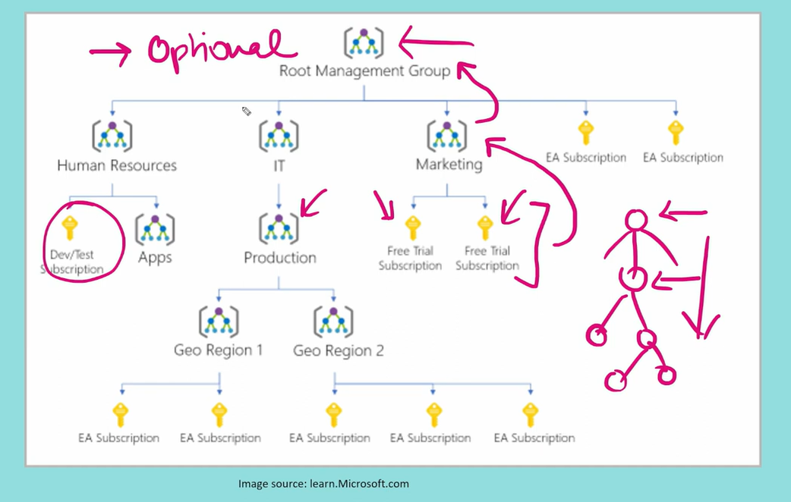
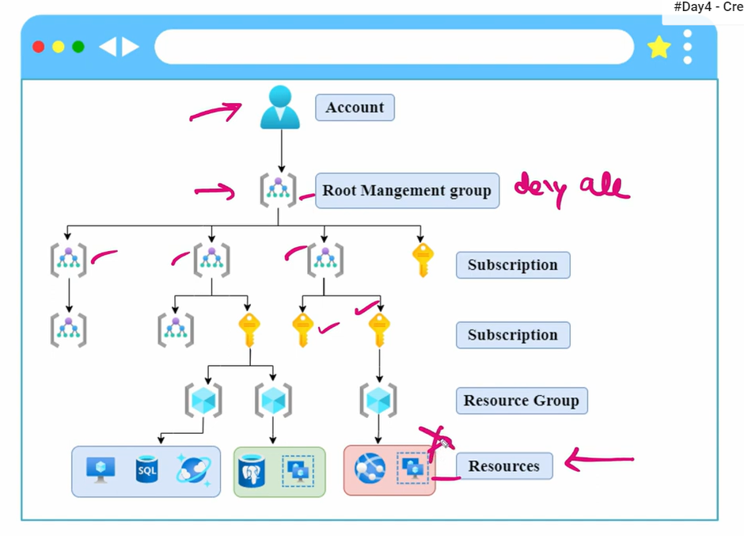
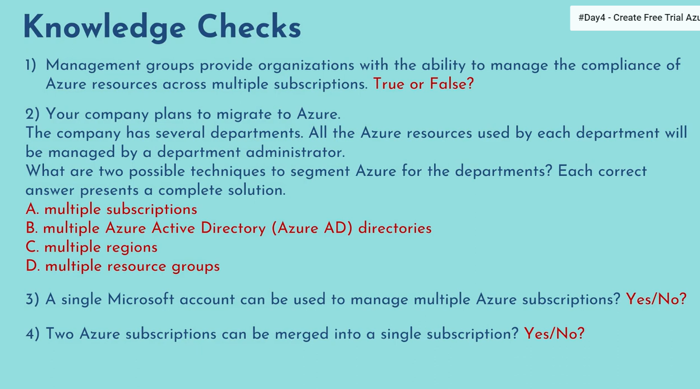
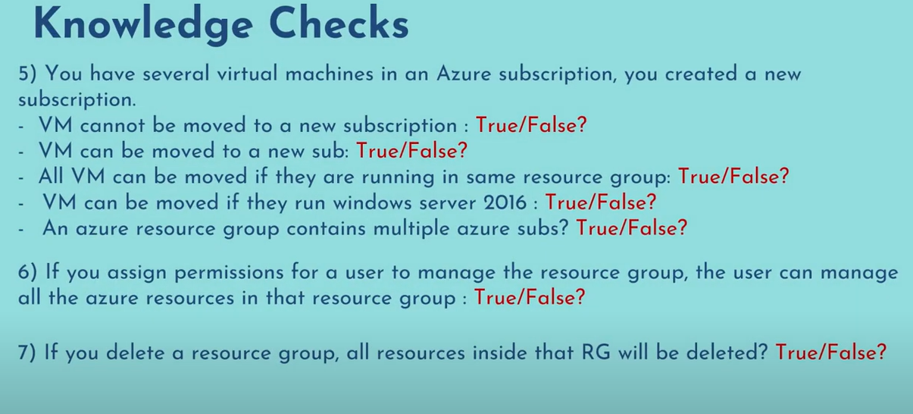

# Azure Resource Hierarchy

- It follows Top-Down Approach
- If any policy applied to subscription section it will inherit to Resource groups section
and if any policy applied to resource groups section it will inherit to resources
- A resource can only be part of one resource group.

## Management Groups

- Creating management group is optional, but creating atleast one subscription is mandatory.
- aOne subscription will be created automatically when you create an azure account.

## Combining Both Together

## Knowledge Checks

