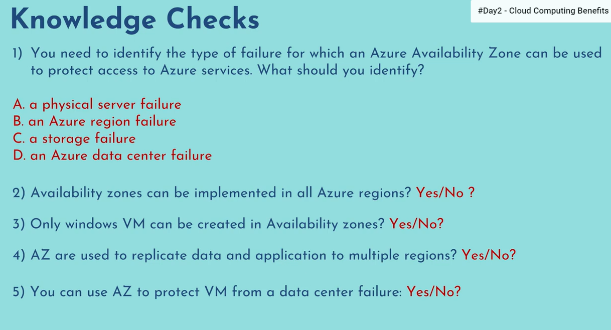
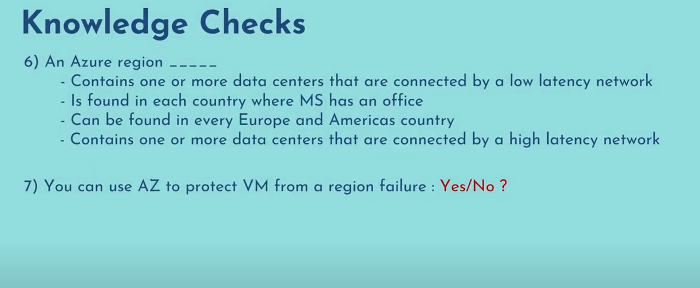

## Data Centers
These are the facilities of resources arranged in racks with dedicated cooling, power and networking infrastructure.

When you create virtual machine or storage disk or any other service it will be deployed in one of this datacenters physically.

### Availability Zone
>Collection of one or more datacenters is known as **availability zone**

### Region
>Collection of multiple availability zone in a geographical location is referred to as a **Region**. Such as US-EAST, US-WEST are 2 seperate regions.

Not all regions support availability zones.

### Region Pairs
Azure regions are paired with another region within the same geography at least 300 miles away to replicate the resources.

>If due to any natural calamity there will be outage in a whole region the services will automatically fail over to the other region in it's region pair and customer would not be impacted.

## Knowledge Checks

