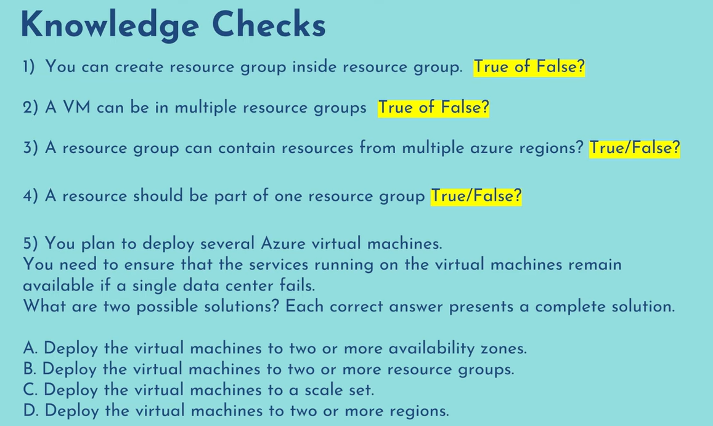

## Virtual Machine
Virtual machine is nothing but a computer sitting on a cloud that you are renting for your specific usecase.

Consider applications in corporate where they need some server to host on. Like you have a website which you are hosting somewhere you can deploy it on virtual machine.

## Resource Groups
They are nothing but logical seperation of resources in a group.

You can create seperate resource for your dev environment, test environment and prod environment.

You can delete all resources inside a resouirce group by deleting a resource group.

## While creating VM

[Watch Video For Creating VM Process](https://youtu.be/Jiyy4Un__7A?list=PLl4APkPHzsUUOCWcjaXcH-WBVxCccZ4uO)

### While Selecting OS disk type :
- Locally - Redundant Storage (data is replicated within a single datacenter) : Means if that datacenter has some issue then data will be unavailable for that much amount of time.
- Zone - Redundant Storage (data is replicated to three zones) : Even if you loose 2 zones your data will be available in 3rd zone.

### Virtual Network
It is just an isolated network in a datacenter where your all resources will reside it will be provisioned.

### Network Security Group
It is nothing but inbound rules which we have enabled like
- SSH access on Port 22

## Knowledge Check

