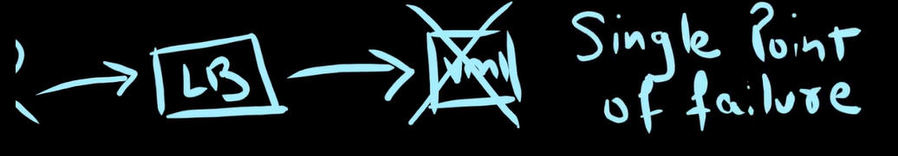
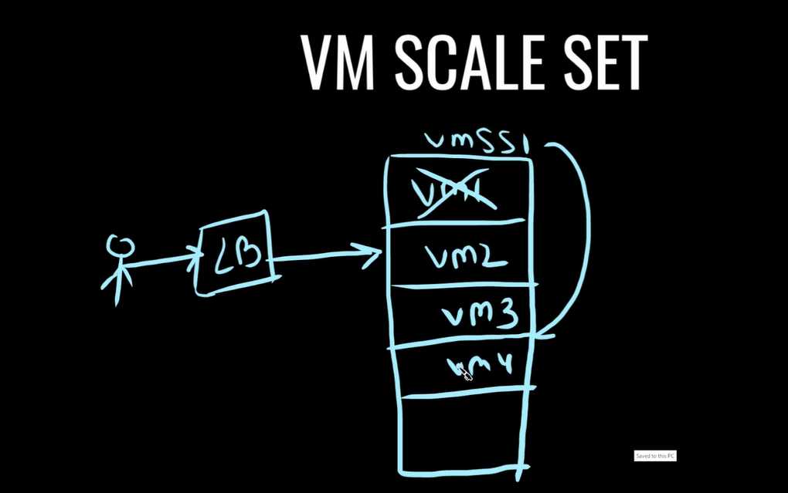
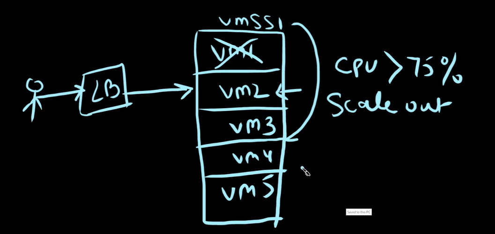
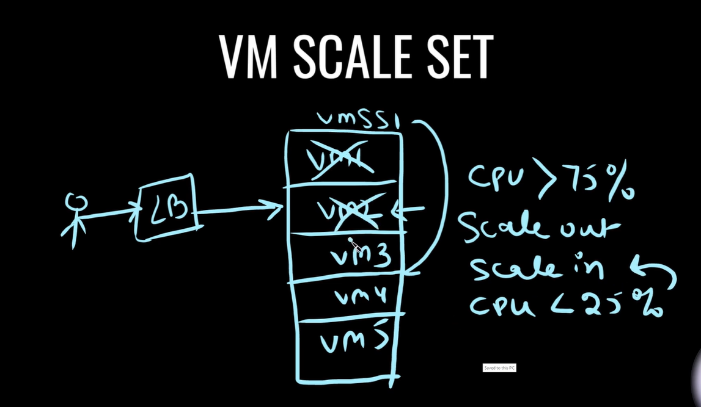
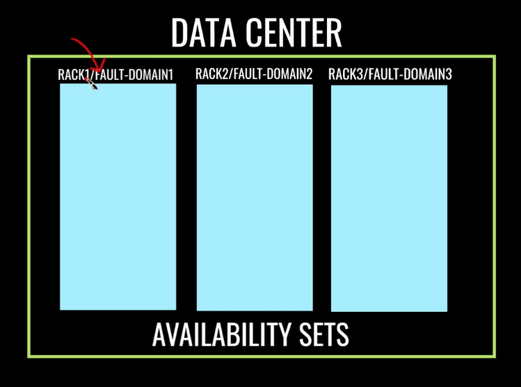
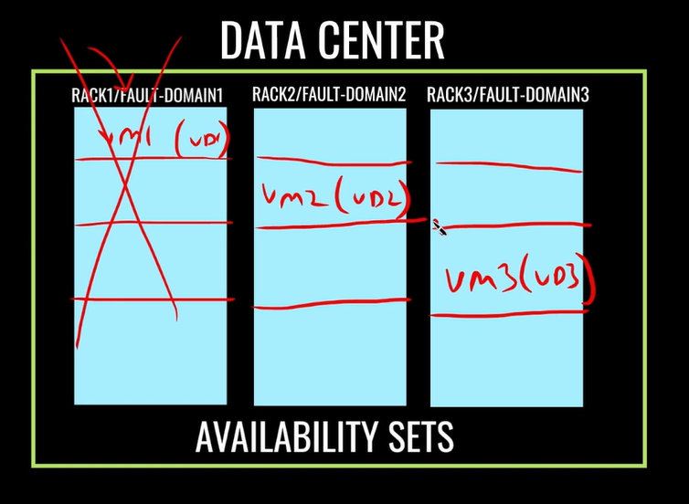
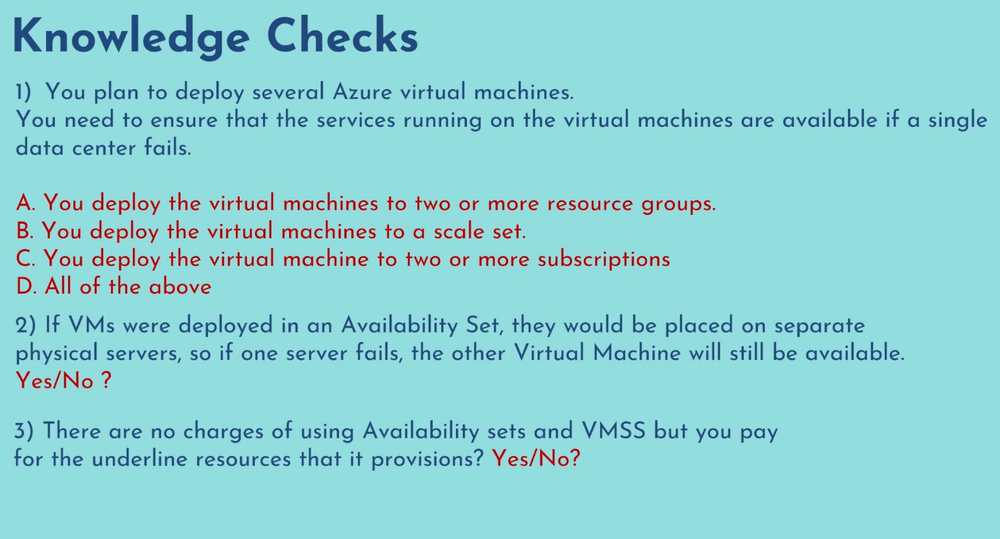

## VM Scale Set

You as a user trying to access application but due to failure of VM1 you are not able to access it so this is known as **single point of failure**. ( LB is load balancer )

Now to avoid single point of failure and make your application highly available we use something called as **virtual machine scaleset**.

Let's say if VM1 goes down VMSS will provison another VM and it will make sure that certain number of VM's are always available and ready to serve the traffic. It also provides automatic Scaling.

### Scale Out

Let's say your VM2 reaches a threshold for CPU usage greater than 75% then VMSS provides another VM5 to balance the load. This process is known as **Scale Out**

### Scale In

Now when load goes down it should automatically scale back to it's original position and that is known as **Scale In** and it will destroy the VM

[How To Create VMSS](https://youtu.be/OFui9yPiLSk?list=PLl4APkPHzsUUOCWcjaXcH-WBVxCccZ4uO&t=224)

You can also select multiple availability zones so that if there is a zone failure, you still have VM's up and running from other availability zones.

## Availability Sets

Your VM's are spread across multiple physical servers in a datacenters to provide high availability.

It spreads across multiple **fault domains and update domains**.

### Fault Domains

They are nothing but your physical server racks and thery are connected to the same power source or switches etc.

### Update Domains

Divide this physical racks in multiple partitions. so these are your update domains. And they are nothing but group of servers that reboots or restarts at the same time to perform any schedule maintenance.

## Knowledge Checks
