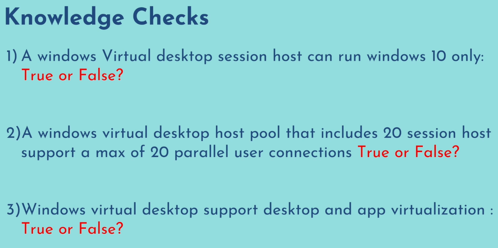

## Azure Virtual Desktop
- Type of managed virtual machine that enables multiple users to access virtual desktops and applications from anywhere, using any device.
- It also provides desktop and application virtualization service that runs on the cloud.
- It provides a scalable and secure solution for remote work and desktop virtualization.
- Secure access through MFA (Multi factor authentication) & RBACs (Role based access control)

## Difference Between Azure Virtual Desktop (AVD) & Azure Virtual Machines (VMs)

|  | Azure Virtual Desktop (AVD) | Azure Virtual Machines (VMs) |
| ---- | ---- | ---- |
| Operating System | Uses desktop operating systems like windows 10 or 11 | Can either use desktop or server operating systems |
| Number of users | Designed for many users to access the same virtual desktop with help of windows 10 and 11 multi session server you can enable concurrent access to multiple users to the same virtual desktop. | Typically used for individual user at one time |
| Maintenance | Managed by microsoft, takes care of maintenance tasks like updates and patches | It is IaaS Service and it is managed by the customer |
| Pricing | Charges per user per month, provides flexibility to organisations with changing needs | Pay per use model |

## Knowledge Checks
