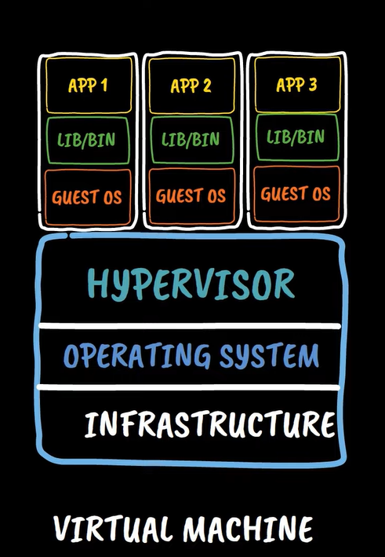

## How a virtual machine is provisioned

- (LEVEL 1) **Infrastructure** (Physical Server that sits somewhere in the data center in case of public cloud or your personal desktop)
- (LEVEL 2) **Operating System** (Windows Or Linux)
- (LEVEL 3) **Hypervisor** (Which makes virtualization possible)

### What is Virtualization

It allows you to run multiple Operating system instances concurrently on a single computer, Means you can run ubuntu, fedora, centos all at the same time on top of your windows machine with help of virtualization.

In case of public cloud your physical server over here is a shared hardware that is being used by multiple organisations and users at the same time, when you request provision of virtual machine through a cloud console it lets you provision a guest VM on top of the Hypervisor, but at the same time the other users and organisations are also using the same physical hardware underneath with the seperate VM, each user installs binaries and libraries on top of it and then your application 

A virtual machine is a software emulation of a physical machine which allows multiple operating systems to run on a single physical machine.

They are also isolated from each other and from the host machine which provides security and stability

## Containers

It allows you to run multiple container instances on a single operating system kernal.

It works same way as hypervisor but for containers

- **Hypervisors** : Multiple virtual machines on a single Operating system
- **Container engine** : Multiple container instances on a single operating system 

### Advantages of containers
- They are light weight alternative to virtual machines with all required libraries and binaries packed within.
- They share the host operating system kernal which makes them more efficient and 

## Azure Container Instances (PaaS)
[Creating Conatiner Instance](https://youtu.be/ehGPuHbwlUs?list=PLl4APkPHzsUUOCWcjaXcH-WBVxCccZ4uO&t=302)